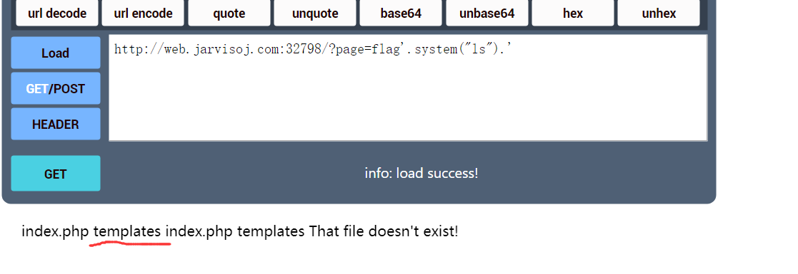

# Writeup-of-web-of-csaw-ctf-2016-quals
This is the Wirteup of web of csaw-ctf-2016-quals

通过 《write-ups-2016》 repository 中链接的几个Writeups可以看到解题方法https://github.com/ctfs/write-ups-2016/tree/master/csaw-ctf-2016-quals/web/mfw

这里是另外一些解题思路和备份。

首先通过上面链接的Writeups里的工具和思路下载得到源码。
主要是index.php源码。
```
<?php

if (isset($_GET['page'])) {
	$page = $_GET['page'];
} else {
	$page = "home";
}

$file = "templates/" . $page . ".php";

// I heard '..' is dangerous!
assert("strpos('$file', '..') === false") or die("Detected hacking attempt!");

// TODO: Make this look nice
assert("file_exists('$file')") or die("That file doesn't exist!");

?>
```
下载到的源码应该是历史版本，所以flag.php中没有给出flag值。
从index.php里可以看出，虽然有require_once $file可以用来包含flag.php，但因为flag是被注释掉的，我们也看不到。
代码中有assert()函数，应该很敏感地想到要利用它来执行任意命令，从而拿到flag。


观察可以发现，page传入的参数存在代码注入漏洞，顺便提一下assert()函数会把传入的字符串当做php代码来执行。

### 注入思路：整体上可以注释掉', '..') === false，或者不注释，只在中间插入。另外要注意闭合单引号和括号。


中间插入型，使用 . 连接符：

查看目录：?page=flag'.system("ls").'




